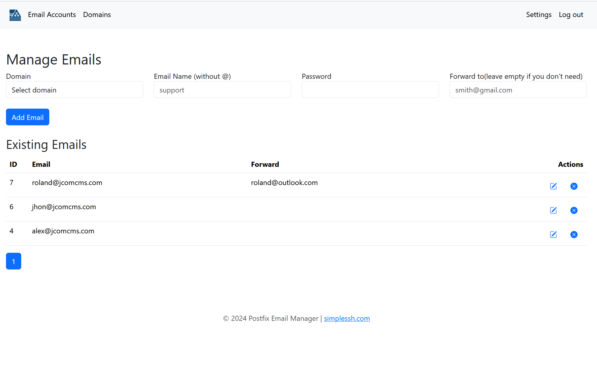

# Postfix email acounts manager
This is a Postfix Email accounts manager like add/create/delete

# Instruction to install the script on nginx or apach server

The installation it's preaty simple
1) install ssh2 php library depend on witch php version you use you may replace this part with your need php8.2-ssh2 OR php8.3-ssh2 OR php8.4-ssh2
check php version enter this in terminal: php -version
install ssh2 librari
sudo apt install php8.3-ssh2
 
3) add this line in php.ini (for nginx: /etc/php/8.3/fpm/php.ini | for apache /etc/php/8.3/cli/php.ini )
extension=ssh2

4) restart appach or niginx
sudo service apache2 restart
sudo service nginx restart

5) check if ssh2 is active 
php -m | grep ssh2

5) copy and unzip files in the location where you want
6) open the database for postfix and check if this table "virtual_admins" exist, if not exist add it: 
  ```  
  CREATE TABLE `virtual_admins` (
      `id` int(11) NOT NULL auto_increment,
      `email` varchar(200) NOT NULL,
      `password` varchar(200) NOT NULL,
      `status` varchar(50) DEFAULT NULL,
      `login_token` varchar(100) DEFAULT NULL,
      `reset_token` varchar(100) DEFAULT NULL,
      `date_log` datetime DEFAULT NULL,
      PRIMARY KEY (`id`) 
    ) ENGINE=InnoDB DEFAULT CHARSET=utf8
```

7) open config/config.php and add postfix database credential you can find them in: /etc/postfix/mysql-virtual-alias-maps.cf
``` 
$host = 'localhost'; // Your database host
$db   = 'database name'; // Your database name
$user = 'database user'; // Your database username
$pass = 'password'; // Your database password
``` 
and save the file


8) open the domain where you install the script like mailcontrol.yourdomain.com
and if it's new instalation than you will need to create an admin, so enter email and password for admin

## photos



 
@Author Corneli F.